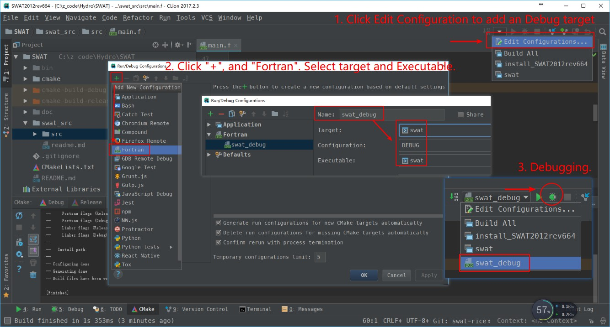

# Compile SWAT from Source Code with CMake
# 1. Prerequisite

+ CMake2.8+
+ Windows:
  + Microsoft Visual Studio 2010+ and Intel Fortran compiler (ifort) 12.0+
  + or CLion and mingw64 (with gfortran 4.8+)
+ Linux/macOS:
  + GCC (with gfortran installed) 4.8+
  + ifort 12.0+

# 2. Compile procedure

+ common commands

  ```shell
  cd <path to SWAT>
  mkdir build
  cmake ..
  make && make install
  ```


## 2.1. Using Visual Studio and Intel Parallel Studio XE under Windows

 Take VS2013 and Intel_Parallel_Studio_XE_2017 (Intel 17.0.4) as an example.

+ Open "Intel compiler 17.0 Update 4 Intel(R) 64 Visual Studio 2013" from start menu.
+ cd to the compile destination folder. e.g., `cd D:/compile/SWAT_ifort`
+ Run `cmake <path to SWAT src path>`. e.g., `cmake C:\z_code\Hydro\SWAT`
  + Compile 64-bit version: `cmake -G "Visual Studio 12 2013 Win64" C:\z_code\Hydro\SWAT`
+ Open the project `SWAT2012rev664.sln`, and do what you want!

## 2.2. Using GCC(gfortran) under Windows, Linux, and macOS

If you prefer the command line, the common commands above should be OK. Note that if you want specify a Fortran compiler, please add the following command before `cmake` command.

```shell
export FC=/path/to/your/own/Fortran/compiler
# e.g., ifort
export FC=/share/soft/intel/composer_xe_2011_sp1.6.233/bin/intel64/ifort
# e.g., gfortran
export FC=/home/zhulj/gcc4.8.4/bin/gfortran
```


However, if you want a user-friendly IDE for to learn and improve the SWAT model, I recommend the cross-platform IDE [CLion](https://www.jetbrains.com/clion/) with [Fortran plugin](https://plugins.jetbrains.com/plugin/9699-fortran).

CLion use CMake to manage projects. Under Windows, you may also install mingw64 (or mingw) for the gfortran compiler.

Using CLion is quite easy and intuitive. Just open the SWAT path from `File -> Open...`. Then CLion will automatically load the project by CMakeLists.txt existed in SWAT directory.  Now, you can build SWAT model by typing `Ctrl+F9` or clicking the build button.

With the latest [Fortran plugin with GDB support](https://plugins.jetbrains.com/plugin/9699-fortran/update/39683),
we can debugging SWAT in the familiar JetBrains' way.



# 3. Update with the latest SWAT source (For administrator only)

In order to make it easier to track code changes and keep up with newer revisions, I use subtree to manage the [SWAT source code from tamu](https://github.com/crazyzlj/swat_src_tamu).

+ Set subtree as `swat_src`(only do once at the very beginning of this repository)

  ```bash
   git remote add -f swat_src git@github.com:crazyzlj/swat_src_tamu.git
   git subtree add --prefix=swat_src swat_src master --squash
  ```

+ Do any modification to the `swat_src` to meet our specific needs.

+ If the SWAT source is updated we should pull the latest code from [swat_src_tamu](https://github.com/crazyzlj/swat_src_tamu) and merge it.

  ```shell
  git fetch swat_src master
  git subtree pull --prefix=swat_src swat_src master --squash
  ```

# 4. Changelog

+ 9/11/2017: Bugs fixed or code improvement. Cross-platform compilation.

  + Code improvement:

    ``` fortran
    !! 1. Error: Symbol 'XXX' at (1) has no IMPLICIT type
    !! 2. Function 'XXXX' at (1) has no IMPLICIT type
    ```

  + Bugs:

    ```fortran
    !! 1. Typo
    !! e.g., hhwatqual.f
    if (orgpin < 1.e-6) orgnpin = 0.0
    !! should be
    if (orgpin < 1.e-6) orgpin = 0.0
    !! 2. Float equal
    if (rg_orifice(i,kk)==1) then
    !! changed to
    if (abs(rg_orifice(i,kk)-1.)<1.e-5) then
    ```

    ​

+ 9/10/2017: Update to rev.664 and test compilation on VS2013+IVF 17.0


# 5. Reference
+ [Compile and Debug SWAT with gfortran and Eclipse by Dr. Zhiqiang Yu](https://zhiqiangyu.wordpress.com/2014/10/01/compile-and-debug-swat-with-gfortran-and-eclipse/)
  + If you cannot access [google drive](https://drive.google.com/file/d/0B16YhFB_9MejSG15ai0zYS1fMkU/edit?usp=sharing) for the `Makefile` or [google docs](https://docs.google.com/document/d/16Do2U1_v4mZZBOV0hmcs6Gh1UvAUAXOMidpB-SE203A/edit?usp=sharing) for the single document guide, these files are located in `SWAT/posts_by_zhiqiang`.
+ https://github.com/mlt/swat

# 6. Contact

Liangjun Zhu  (crazyzlj@gmail.com)