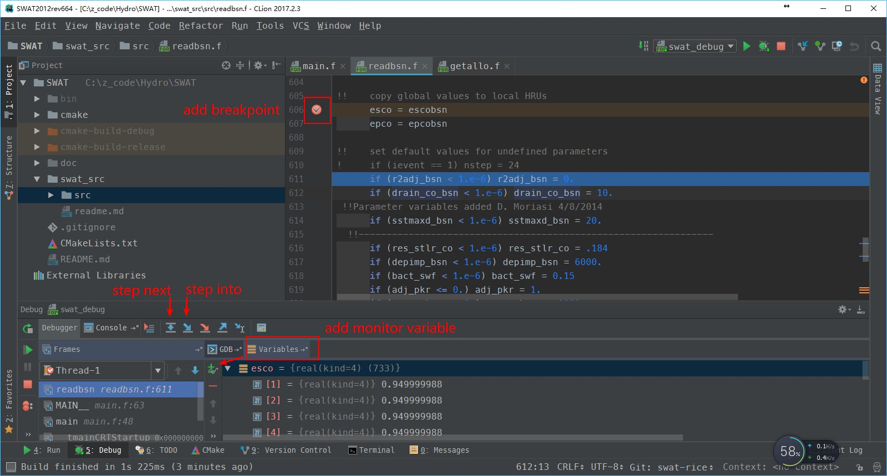

# Unofficial collection of SWAT code

# 0. Branches

+ **master**: Branch of revised official code. DO NOT merge other branches to the master branch!!! Once a new version of SWAT source code available, the master branch should be updated accordingly and merged to other branches!
+ **swat-rice**: SWAT for paddy rice modeling which is under development.

# 1. Prerequisite

+ CMake2.8+
+ Windows:
  + Microsoft Visual Studio 2010+ and Intel Fortran compiler (ifort) 12.0+
  + or CLion and mingw64 (with gfortran 4.8+)
+ Linux/macOS:
  + GCC (with gfortran installed) 4.8+
  + ifort 12.0+

# 2. Compile procedure

+ common commands

  ```shell
  cd <path to SWAT>
  mkdir build
  cd build
  cmake ..
  make && make install
  ```

## 2.1. Using Visual Studio and Intel Parallel Studio XE under Windows

 Take VS2013 and Intel_Parallel_Studio_XE_2017 (Intel 17.0.4) as an example.

+ Open "Intel compiler 17.0 Update 4 Intel(R) 64 Visual Studio 2013" from start menu.
+ cd to the compile destination folder. e.g., `cd D:/compile/SWAT_ifort`
+ Run `cmake <path to SWAT src path>`. e.g., `cmake C:\z_code\Hydro\SWAT`
  + Compile 64-bit version: `cmake -G "Visual Studio 12 2013 Win64" C:\z_code\Hydro\SWAT`
+ Open the project `SWAT<yyyy>rev<Num>.sln`, e.g. `SWAT2012rev664.sln`, right-click the solution name and select `Build Solution`.
+ After the compilation, right-click the `INSTALL` project and select `Build`, the executable of SWAT named `swat<yyyy>Rev<Num><BuildType>` will be located in `<path to SWAT src path>/bin`, e.g., `C:\z_code\Hydro\SWAT\swat2012Rev664Rel.exe`. In which `Dbg` for Debug, `Rel` for Release, etc.

## 2.2. Using GCC(gfortran) under Windows, Linux, and macOS

If you prefer the command line, the common commands above should be OK. Note that if you want specify a Fortran compiler, please add the following command before `cmake` command.

```shell
export FC=/path/to/your/own/Fortran/compiler
# e.g., ifort
export FC=/share/soft/intel/composer_xe_2011_sp1.6.233/bin/intel64/ifort
# e.g., gfortran
export FC=/home/zhulj/gcc4.8.4/bin/gfortran
```

However, if you want a user-friendly IDE for to learn and improve the SWAT model, I recommend the cross-platform IDE [CLion](https://www.jetbrains.com/clion/) with [Fortran plugin](https://plugins.jetbrains.com/plugin/9699-fortran).

CLion use CMake to manage projects. Under Windows, you may also install mingw64 (or mingw) for the gfortran compiler.

Using CLion is quite easy and intuitive. Just open the SWAT path from `File -> Open...`. Then CLion will automatically load the project by CMakeLists.txt existed in SWAT directory.  Now, you can build SWAT model by typing `Ctrl+F9` or clicking the build button.

With the latest [Fortran plugin with GDB support](https://plugins.jetbrains.com/plugin/9699-fortran/update/39683),
we can debugging SWAT in the familiar JetBrains' way.





# 3. References
+ [Compile and Debug SWAT with gfortran and Eclipse by Dr. Zhiqiang Yu](https://zhiqiangyu.wordpress.com/2014/10/01/compile-and-debug-swat-with-gfortran-and-eclipse/)
+ https://github.com/mlt/swat
